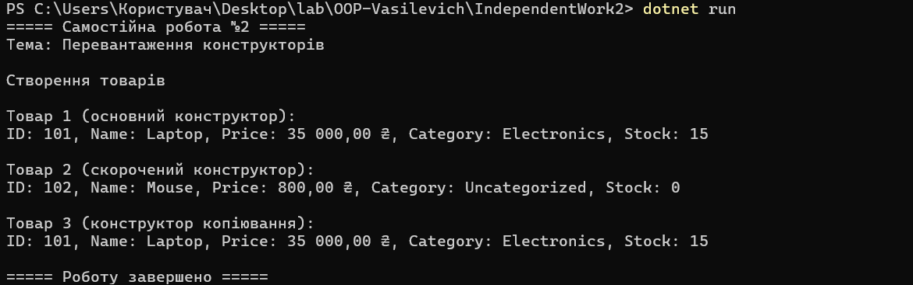

# Самостійна робота №2

## Тема

**Перевантаження конструкторів**

## Мета роботи

Ознайомитися з поняттям перевантаження конструкторів у мові програмування C#. Навчитися створювати декілька конструкторів для одного класу, використовувати виклик одного конструктора з іншого за допомогою `this(...)`, створювати конструктор копіювання та перевизначати метод `ToString()`.

## Завдання

Створити консольний проєкт `IndependentWork2`.

Реалізувати клас `Product`, який описує товар. Клас повинен містити приватні поля, властивості лише для читання, три перевантажені конструктори та перевизначений метод `ToString()`.

У методі `Main()` необхідно створити три об'єкти класу `Product`, використовуючи кожен із конструкторів, та вивести інформацію про товари на екран.

## Клас Product

Клас `Product` містить такі приватні поля:

* `_id` — ідентифікатор товару;
* `_name` — назва товару;
* `_price` — ціна товару;
* `_category` — категорія товару;
* `_stockCount` — кількість товару на складі.

## Read-only властивості

Для доступу до приватних полів створено публічні властивості лише для читання:

* `Id`
* `Name`
* `Price`
* `Category`
* `StockCount`

Властивості мають тільки `get`, тому після створення об'єкта змінити значення властивостей безпосередньо неможливо.

## Основний конструктор

Основний конструктор приймає всі п'ять параметрів:

Product(int id, string name, decimal price, string category, int stockCount)

Він використовується для повної ініціалізації об'єкта товару.

## Скорочений конструктор

Скорочений конструктор приймає тільки три параметри:

Product(int id, string name, decimal price)

Він викликає основний конструктор за допомогою `this(...)`.

Для категорії автоматично встановлюється значення `Uncategorized`, а кількість товару на складі встановлюється рівною `0`.

## Конструктор копіювання

Конструктор копіювання приймає інший об'єкт класу `Product`:

Product(Product other)

Він також викликає основний конструктор за допомогою `this(...)` та копіює всі значення з існуючого об'єкта.

## Метод ToString()

Метод `ToString()` перевизначено для зручного виведення повної інформації про товар.

Виводяться:

* ID;
* назва;
* ціна;
* категорія;
* кількість товару на складі.

## Демонстрація роботи

У методі `Main()` створено три об'єкти:

1. `product1` — за допомогою основного конструктора;
2. `product2` — за допомогою скороченого конструктора;
3. `product3` — за допомогою конструктора копіювання.

## Результат роботи програми


## Контрольні питання

### 1. Для чого потрібне перевантаження конструкторів?

Перевантаження конструкторів дозволяє створювати об'єкти одного класу різними способами. Для цього в класі можна мати декілька конструкторів із різною кількістю або типами параметрів.
Це робить створення об'єктів більш зручним та гнучким.

### 2. Чому конструктор копіювання зручно реалізовувати через `this(...)`?

Використання `this(...)` дозволяє передати значення до основного конструктора та не дублювати код ініціалізації полів.
Таким чином, логіка створення об'єкта знаходиться в одному основному конструкторі.

### 3. Які переваги дають властивості лише для читання після створення об'єкта?

Read-only властивості дозволяють отримувати значення полів, але не дозволяють змінювати їх безпосередньо після створення об'єкта.
Це допомагає контролювати стан об'єкта та захищає його дані від випадкової зміни.

### 4. Коли перевизначення `ToString()` спрощує налагодження та демонстрацію?

Перевизначений `ToString()` дозволяє одразу отримати зрозуміле текстове представлення об'єкта.
Замість виведення кожного поля окремо можна написати `Console.WriteLine(product)`, після чого автоматично буде виведена вся необхідна інформація про товар.

## Структура проєкту

```text
IndependentWork2/
│
├── IndependentWork2.csproj
├── Program.cs
└── README.md
```

## Перевірка

Проєкт успішно компілюється та запускається командою:

dotnet run

У програмі продемонстровано роботу трьох перевантажених конструкторів класу `Product`:

* основного конструктора;
* скороченого конструктора;
* конструктора копіювання.

Також перевірено роботу властивостей лише для читання та перевизначеного методу `ToString()`.

## Висновок

У ході виконання самостійної роботи було опрацьовано перевантаження конструкторів у C#. Було створено клас `Product` з приватними полями та властивостями лише для читання. Реалізовано основний, скорочений та конструктор копіювання. Для уникнення дублювання коду використано виклик `this(...)`. Також було перевизначено метод `ToString()` для зручного виведення інформації про об'єкти. У результаті програма успішно компілюється та демонструє роботу всіх реалізованих конструкторів.
