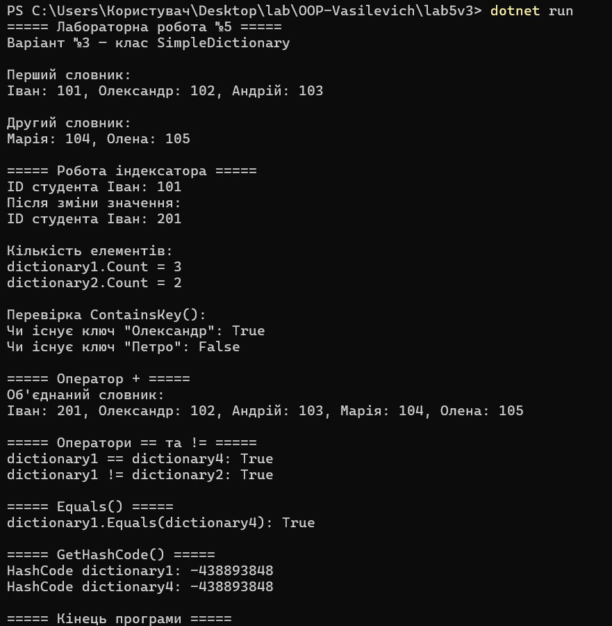

# Лабораторна робота №5

### **Тема:** Індексатори та перевантаження операторів.

### Варіант: 3 - Клас SimpleDictionary

* **Поля:** `_data` (Dictionary<string, int>).
* **Індексатор:** `this[string key]`.
* **Властивості:** `Count`.
* **Оператори:** `+` (об'єднання словників), `==` та `!=` (порівняння словників).
* **Методи:** `ContainsKey(string key)`, `ToString()`, `Equals()`, `GetHashCode()`.

# **Хід роботи:**

### Було встановлене середовище розробки VS Code з усіма необхідними розширеннями: C# Dev Kit; .NET Install Tool.

### Було створено консольний проєкт `lab5v3` у директорії `OOP-Vasilevich`. Відповідно до варіанту створив клас **SimpleDictionary**. Клас містить: **Приватне поле:** `_data` типу `Dictionary<string, int>` для зберігання пар ключ-значення. **Індексатор:** `this[string key]`, який дозволяє отримувати та змінювати значення словника за ключем. **Публічну властивість:** `Count`, яка повертає кількість елементів словника. **Метод:** `ContainsKey(string key)` для перевірки наявності заданого ключа. **Перевантажені оператори:** `+` для об'єднання двох словників, а також `==` та `!=` для порівняння їхнього вмісту. **Перевизначені методи:** `ToString()`, `Equals()` та `GetHashCode()` для виведення та коректного порівняння об'єктів.

### Створив клас **Program**. У методі **Main()** було створено декілька об’єктів класу **SimpleDictionary**. Для об’єктів було продемонстровано роботу індексатора: отримання значення за ключем та його зміна. Також було перевірено роботу властивості **Count** та методу **ContainsKey()**. Для демонстрації перевантажених операторів було виконано об’єднання словників за допомогою **operator +** та порівняння об’єктів за допомогою операторів **==** та **!=**. Додатково було продемонстровано роботу методів **Equals()**, **GetHashCode()** та **Console.WriteLine()** для виведення результатів роботи програми.

