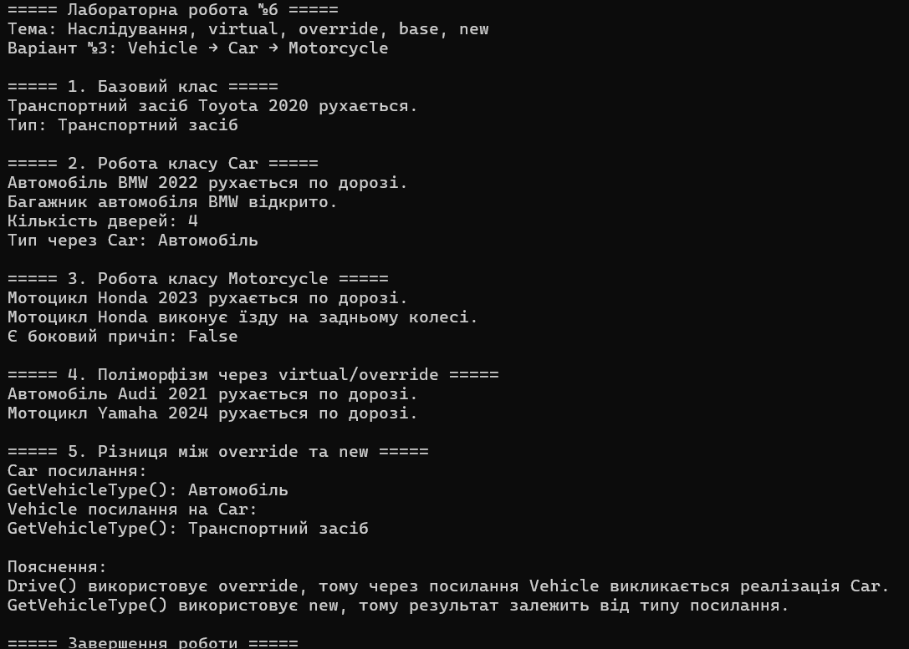

# Лабораторна робота №6

## Тема

Наслідування. Ключові слова `base`, `virtual`, `override`. Приховування членів за допомогою `new`.

## Мета роботи

Навчитися створювати ієрархії класів, використовувати ключові слова `base`, `virtual`, `override` для реалізації поліморфізму, а також розуміти відмінності між `override` та приховуванням членів за допомогою `new`.

## Варіант

**Варіант №3 — Vehicle → Car → Motorcycle**

## Опис ієрархії

У лабораторній роботі реалізовано ієрархію транспортних засобів.

### Базовий клас Vehicle

Клас `Vehicle` містить:

- `Brand` — марка транспортного засобу;
- `Year` — рік випуску;
- конструктор для ініціалізації властивостей;
- віртуальний метод `Drive()`;
- метод `GetVehicleType()` для демонстрації приховування через `new`.

### Похідний клас Car

Клас `Car` успадковує `Vehicle` та містить:

- `NumDoors` — кількість дверей;
- перевизначений метод `Drive()` за допомогою `override`;
- метод `OpenTrunk()` для відкриття багажника;
- метод `GetVehicleType()`, позначений `new`.

Конструктор `Car` викликає конструктор базового класу за допомогою `base(...)`.

### Похідний клас Motorcycle

Клас `Motorcycle` успадковує `Vehicle` та містить:

- `HasSidecar` — наявність бокового причепа;
- перевизначений метод `Drive()` за допомогою `override`;
- метод `Wheelie()` для демонстрації їзди на задньому колесі.

Конструктор `Motorcycle` викликає конструктор базового класу за допомогою `base(...)`.

## Демонстрація поліморфізму

У програмі створюються об'єкти `Car` та `Motorcycle`, після чого вони використовуються через посилання типу `Vehicle`.

Наприклад:

```csharp
Vehicle carAsVehicle = new Car("Audi", 2021, 4);
Vehicle motorcycleAsVehicle = new Motorcycle("Yamaha", 2024, true);

